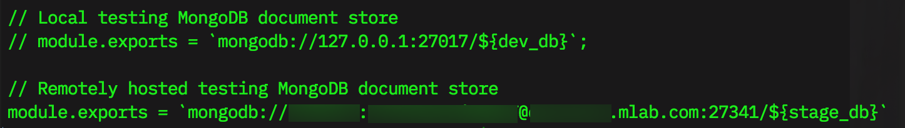
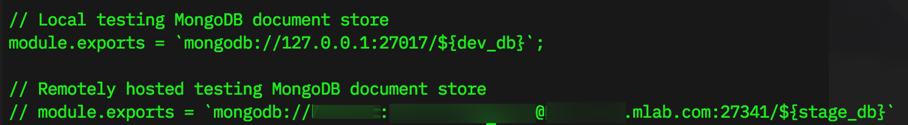

# SETUP.md

# BASIC REQUIREMENTS
This project assumes the following software and versions are installed and available to the systems environment variables at the shell in either Terminal (Linux/maxOS), or GitBash (Windows).

  - Node (v8.12+ Required, v10.11 Recommended)
  - NPM (v6.5 Required)
  - Angular CLI (v7.1.3)
  - MongoDB (Optional/Recommended v4.0+)

# PREPARATIONS

## PROJECT INITIALIZATION

### Part 1 - Mongo

The user of this repo must supply a file inside the angular base directory with the following code. This code is what supplies the connection information to the datastore of choice.

```
const dev_db = '<localdev-db-name>'; // Name of local MongoDB instance
const stage_db = '<remote-db-name>'; // Name of remote MongoDB instance

// Local testing MongoDB document store
module.exports = `mongodb://127.0.0.1:27017/${dev_db}`;

// Remotely hosted testing MongoDB document store
// module.exports = `mongodb://<mlab-user-id>:<mlab-user-password>@<mlab-server>.mlab.com:<mlab-port>/${stage_db}`
```

#### Option 1 - Remote MongoDB using mLab

1. Edit the file `bot-express/config/mongo.js` so that the `module.exports` connection string for the remote MongoDB is uncommented, while ensureing that the `localhost` connection string is commented out.



That is all that is required, as the datastore has already been initialized and is ready to go.

#### Option 2 - Local Instance of MongoDB

  1. Edit the file `bot-express/config/mongo.js` so that the localhost `module.exports`connection string for MongoDB is uncommented, while ensureing that the  `remote MongoDB` connection string is commented out.



  2. Open a shell session and either, open Terminal or Git-Bash, depending on your OS.  Navigate to the directory `bot-express` and run the following command:
          `node config/init_data.js`

      Once you see the message `completed initialization`, your MongoDB datastore should be ready to receive connections.

### PART 2 - Node/Express API
1. From the terminal navigate to the `bot-express` folder and type the following commands:

        npm install
        npm start

    This will initialize and start the Express API server and

### Part 3 - Angular Front-end

-  **!!! IMPORTANT !!!**
1. ***Start a new terminal session in a new window*** and then, from the terminal navigate to the `bot-ng` folder and type the following commands:

        npm install
        npm start

    This will initialize and start the Angular Single-Page Application and open a browser window displaying the app.

# WRAP UP
After you are done with the applicatoin, you may close the browser, terminate the running processes in your terminal windows, and close the windows.

<sub>Written and produced by [Ben Nowak](https://bennowak.github.io/)</sub>
